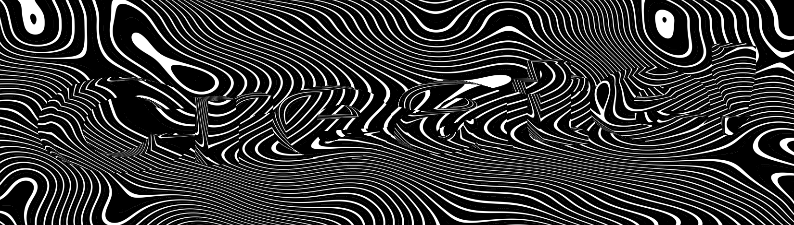

Following Yuri Artiukh's ["Noisy lines" live stream episode](https://www.youtube.com/watch?v=2a2P8-PyNGA&list=PLswdBLT9llbheHhZdGNw9RehJP1kvpMHY&index=21):

He recreates the design from https://www.imdsg.ch/

There are many designs on that site - [here's a link](https://www.imdsg.ch/?mode=Lines&text=YAY!&a=0.425&b=0.421&c=0.448&d=0.525) to one close to what is reproduced here.

(Mistakes are my own.)

The shader GLSL contains code by others:
[aastep by Matt DesLauriers](https://github.com/glslify/glsl-aastep/blob/master/index.glsl)

[cnoise (Perlin noise) by Stefan Gustavson](https://gist.github.com/patriciogonzalezvivo/670c22f3966e662d2f83)

## Screenshot



## Run

run with Matt DesLauriers' canvas-sketch: 

```
canvas-sketch src/sketch.js  
```